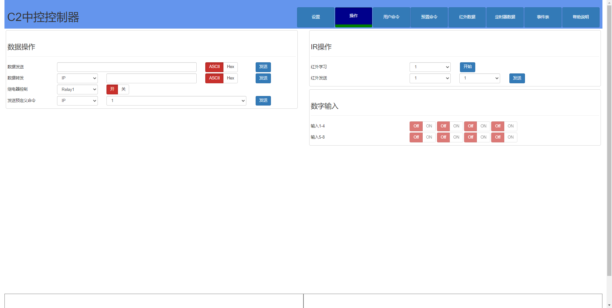
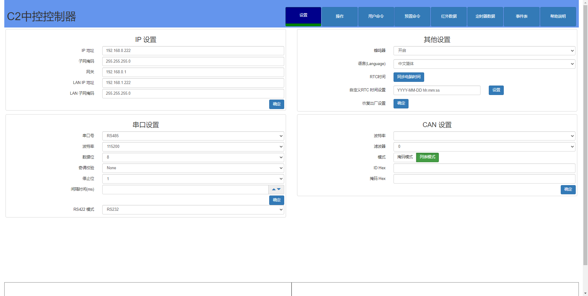
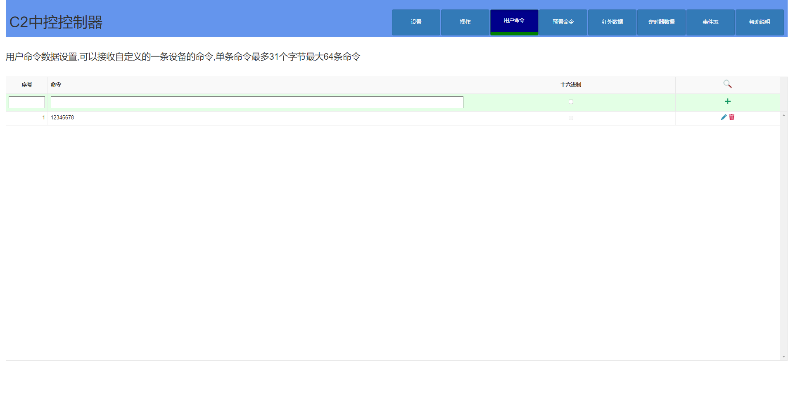
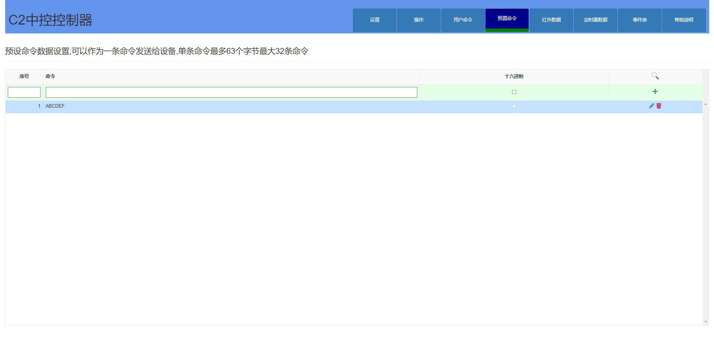

# 主机设置

&emsp;&emsp;**C2 中控** 提供了后端Web 界面设置。

&emsp;&emsp;本主机提供了Web 免编程设置。根据主机C2的IP 地址，浏览器登陆(默认地址为 http://192.168.0.200)
&emsp;&emsp;我们这里以 192.168.0.222 为例
&emsp;&emsp;登陆用户名和密码都是admin

## 操作界面
 
  

## 设置界面

 
 

## 用户命令界面

 

## 预设命令界面
 