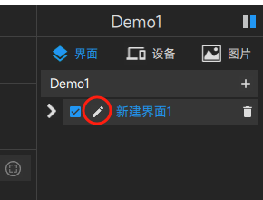

# 高级用法

## 页面跳转
点击Design 左上角 “+” 出现如下界面  
  
操控台名称： 他会显示在终端界面的标题上(此处我们设为页面跳转)  
屏幕分辨率： 根据终端界面分辨率选择合适的大小分辨率  
点击"创建" 按钮进入设计界面

## 创建一个界面
设计器右上角点击 Demo1 右边的 " + ",出现如下串口  
  
点击 "添加" 按钮  
### 给界面添加背景图片
点击快捷按钮里的"导入图片"，  
  
选择图片所在的目录，打开目录后选择多个需要的图片。可以多次从多个目录里加入图片。  
### 编辑界面
点击界面的编辑按钮  
  
出现编辑界面，    
  
点击 界面的背景图标 选择所需要的图片。  
  
注意： 缩放控件至图片大小 复选框，选中表示 会改变控件的大小， 默认不选，这样图片会铺满整个界面(界面也是一个控件）    
点击界面的"确认"按钮完成界面的背景设置  

##如图，创建3个几个界面  
  
这里我们界面2，界面3 比 界面1 小, 防止显示界面2,3 的时候把界面1 挡住导航控件。  

##在界面1里增加两个界面导航控件
选中界面1, 把“界面切换”控件拖到界面1上

## 设置“界面切换”控制

显示界面1 控件设置属性：

  
显示界面2 控件设置属性：

