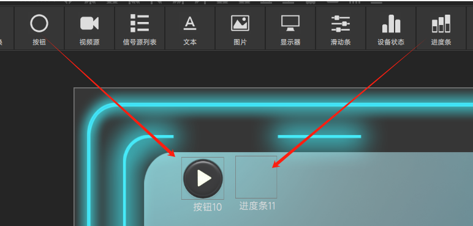

# 高级用法

## 页面跳转
点击Design 左上角 “+” 出现如下界面  
  
操控台名称： 他会显示在终端界面的标题上(此处我们设为“页面跳转”)  
屏幕分辨率： 根据终端界面分辨率选择合适的大小分辨率  
点击"创建" 按钮进入设计界面

### 创建多个界面
设计器右上角点击 Demo1 右边的 " + ",出现如下串口  
  
点击 "添加" 按钮  
#### 给界面添加背景图片
点击快捷按钮里的"导入图片"，  
  
选择图片所在的目录，打开目录后选择多个需要的图片。可以多次从多个目录里加入图片。  
#### 编辑界面
点击界面的编辑按钮  
  
出现编辑界面，    
  
点击 界面的背景图标 选择所需要的图片。  
  
注意： 缩放控件至图片大小 复选框，选中表示 会改变控件的大小， 默认不选，这样图片会铺满整个界面(界面也是一个控件）    
点击界面的"确认"按钮完成界面的背景设置  

### 如图创建3个界面  
  
这里我们界面2，界面3 比 界面1 小, 防止显示界面2,3 的时候把界面1 挡住导航控件。  

### 在界面1里增加两个界面导航控件
选中界面1, 把“界面切换”控件拖到界面1上  

### 设置“界面切换”控制

显示界面1 控件设置属性：

  
显示界面2 控件设置属性：

这样我们 运行时候 点击”显示界面1“ 时候就 显示了界面1和界面2
                  点击”显示界面2" 时候就 显示了界面1和界面3
				  
				  
## 单个按钮 发送多条命令
在界面上拖入一个按钮和一个进度条  
  
把按钮绑定进度条，在按钮的属性设置了，勾选“绑定进度条”  
  
进度条名字填写 进度条的ID 号。  
设置进度条控件的属性  
 

这样就完成了如下的流程
1.按下按钮 (发送按钮按下的指令)--> 抬起按钮(发送抬起的指令,此处没有)---> 经过5秒--> 发送进度条的第1条指令---> 经过5秒--> 发送进度条的第2条指令

## 矩阵模式按钮功能(组合功能)
功能描述： 输入一组按钮, 按下输入的其中一个,其他按钮会弹起(类似组合框)
输出一组按钮,选中按下一个按钮, 会发送一个跟输入相关的一条命令  
我们以矩阵切换命令来举例  
比如:  

|命令|十六进制|  说明  |
|:---------:|----------|-----|
|SW 1 1\r\n |53 57 20 31 20 31 0D 0A| 输入1到输出1|
|SW 1 2\r\n |53 57 20 31 20 32 0D 0A| 输入1到输出2|
|SW 1 3\r\n |53 57 20 31 20 33 0D 0A| 输入1到输出3|
|SW 1 4\r\n |53 57 20 31 20 34 0D 0A| 输入1到输出4|
|SW 2 1\r\n |53 57 20 32 20 31 0D 0A| 输入2到输出1|
|SW 2 2\r\n |53 57 20 32 20 32 0D 0A| 输入2到输出2|
|SW 2 3\r\n |53 57 20 32 20 33 0D 0A| 输入2到输出3|
|SW 2 4\r\n |53 57 20 32 20 34 0D 0A| 输入2到输出4|

这里我们把指令的前5个字节赋给输入按钮 后3个字节赋予矩阵的输出按钮

|按钮|属性| 值 |说明 |
|:------:|-----|-----|-----|
| 输入1 | 设备 | 矩阵1| 按钮跟某个设备绑定|
|       | 自锁 |打勾 |自锁表示按下后松开鼠标不会自动弹起|
|       | 矩阵名称 |矩阵1| 绑定相同的设备名称|
|       | 矩阵类型 | 输入| 输入 类似与多选一的组合|
|       | 矩阵数据 |53 57 20 31 20| |
| 输入2 | 设备 | 矩阵1| 按钮跟某个设备绑定|
|       | 自锁 |打勾 |自锁表示按下后松开鼠标不会自动弹起|
|       | 矩阵名称 |矩阵1| 绑定相同的设备名称|
|       | 矩阵类型 | 输入| 输入 类似与多选一的组合|
|       | 矩阵数据 |53 57 20 32 20| |
| 输入3 | 设备 | 矩阵1| 按钮跟某个设备绑定|
|       | 自锁 |打勾 |自锁表示按下后松开鼠标不会自动弹起|
|       | 矩阵名称 |矩阵1| 绑定相同的设备名称|
|       | 矩阵类型 | 输入| 输入 类似与多选一的组合|
|       | 矩阵数据 |53 57 20 33 20| |
| 输入4 | 设备 | 矩阵1| 按钮跟某个设备绑定|
|       | 自锁 |打勾 |自锁表示按下后松开鼠标不会自动弹起|
|       | 矩阵名称 |矩阵1| 绑定相同的设备名称|
|       | 矩阵类型 | 输入| 输入 类似与多选一的组合|
|       | 矩阵数据 |53 57 20 34 20| |
| 输出1 | 设备 | 矩阵1| 按钮跟某个设备绑定|
|       | 自锁 |打勾 |自锁表示按下后松开鼠标不会自动弹起|
|       | 矩阵名称 |矩阵1| 绑定相同的设备名称|
|       | 矩阵类型 | 输出| 输出 类似有跟输入一起发送数据的功能|
|       | 矩阵数据 |31 0D 0A|
| 输出2 | 设备 | 矩阵1| 按钮跟某个设备绑定|
|       | 自锁 |打勾 |自锁表示按下后松开鼠标不会自动弹起|
|       | 矩阵名称 |矩阵1| 绑定相同的设备名称|
|       | 矩阵类型 | 输出| 输出 类似有跟输入一起发送数据的功能|
|       | 矩阵数据 |32 0D 0A| |
| 输出3 | 设备 | 矩阵1| 按钮跟某个设备绑定|
|       | 自锁 |打勾 |自锁表示按下后松开鼠标不会自动弹起|
|       | 矩阵名称 |矩阵1| 绑定相同的设备名称|
|       | 矩阵类型 | 输出| 输出 类似有跟输入一起发送数据的功能|
|       | 矩阵数据 |33 0D 0A| |
| 输出4 | 设备 | 矩阵1| 按钮跟某个设备绑定|
|       | 自锁 |打勾 |自锁表示按下后松开鼠标不会自动弹起|
|       | 矩阵名称 |矩阵1| 绑定相同的设备名称|
|       | 矩阵类型 | 输出| 输出 类似有跟输入一起发送数据的功能|
|       | 矩阵数据 |34 0D 0A| |

 
 

## 视频预监功能
- 视频源控件： 会出现设置的源的预览小窗口。
- 显示器控件： 类似大屏显示，可以同时显示多个源，带拖动位置,大小开窗漫游供能。主要用于控制流媒体大屏显示。
  这里如果是接分布式流媒体矩阵的话需要对接不同设备的编解码盒子

反控 就是把当前显示设备的 鼠标 消息传给 信号源(比如PC),这个要流媒体支持才行。

