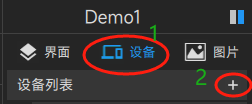
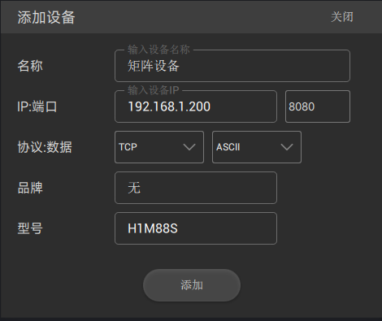
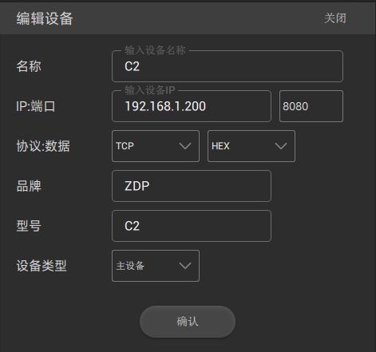

# 设备

- 此处设备是指系统中各种设备，比如音频处理器，拼接处理器，矩阵，中控，电源时序器等等；
- 一个需要发送指令的控件都需要绑定一个设备

## 增加设备  

在设计器右上角选择"设备",点击设备列表的 "+"，    
 

## 设备界面

 

## 设备属性

|属性|解释说明|
|:------:|-----|
| 名称  | 设备名称（控件需要绑定的设备就是这个名字） |
| IP:端口  | 根据设备的ip 地址和 接受控制的端口号填写 |
| 协议：数据  | 选择TCP 或者UDP; 数据选择ASCII 或者HEX |
| 品牌  | 随便填或根据实际来 |
| 型号  | 设备型号 |
| 设备类型 | 如果是中控 前选择“主设备”|

## 中控设备设置例子
 
- 对于免注册软件需要中控设备设置为主设备

**数据选择ASCII 时候在 控件属性里的 关联的 指令数据就需要填写是ASCII字符**   
**数据选择Hex 时候在 控件属性里的 关联的 指令数据就需要填写是HEX 数据**
** HEX 格式包含了 ASCII 的所有字符 我们一般选择HEX 的模式 **
HEX 和 ASCII 互转 [参考这里](https://coding.tools/cn/ascii-to-hex)

