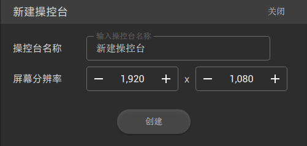
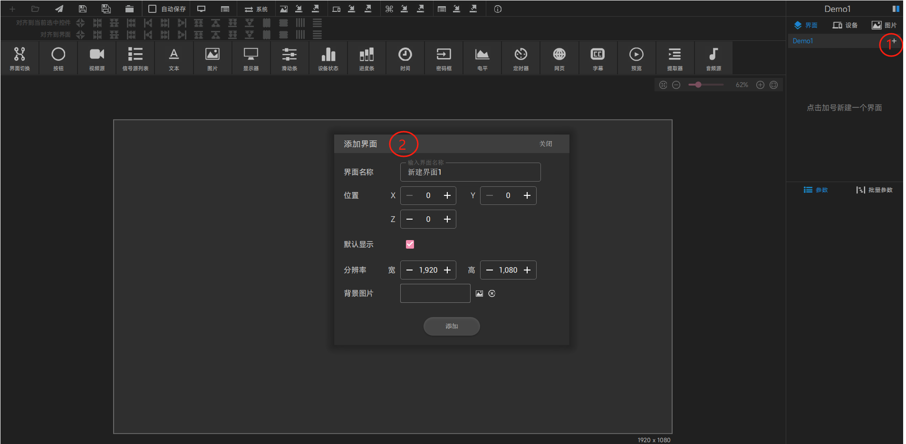
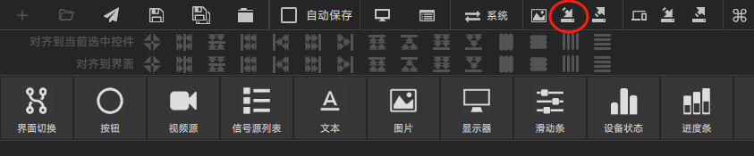
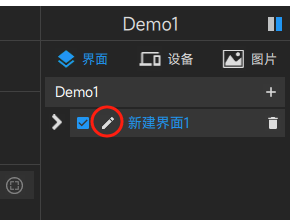
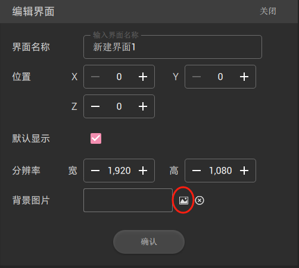
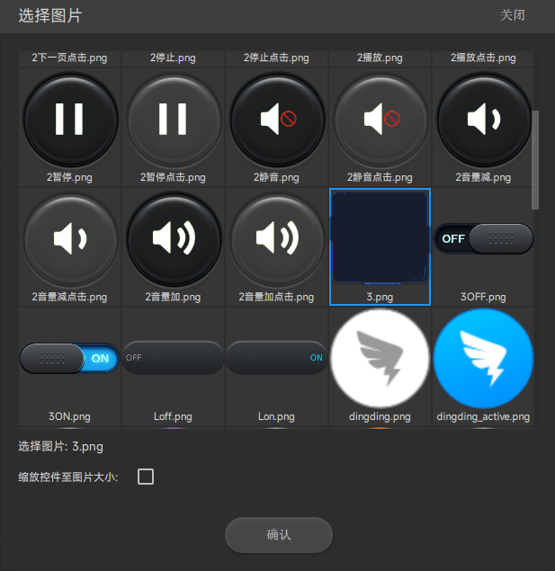
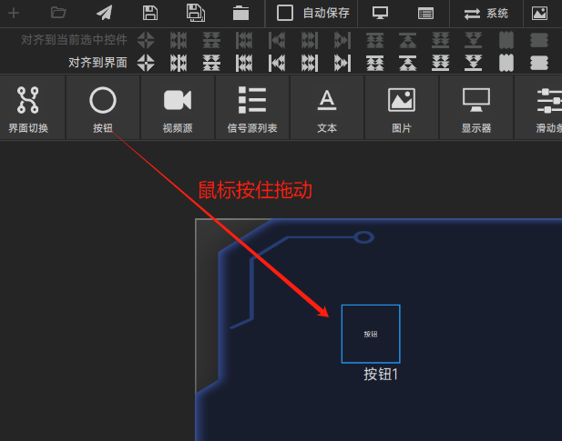

# 新手入门

## 创建一个项目
点击Design 左上角 “+” 出现如下界面  
  
操控台名称： 他会显示在终端界面的标题上(此处我们设为Demo1)  
屏幕分辨率： 根据终端界面分辨率选择合适的大小分辨率  
点击"创建" 按钮进入设计界面

## 创建一个界面
设计器右上角点击 Demo1 右边的 " + ",出现如下串口  
  
点击 "添加" 按钮  
### 给界面添加背景图片
点击快捷按钮里的"导入图片"，  
  
选择图片所在的目录，打开目录后选择多个需要的图片。可以多次从多个目录里加入图片。  
### 编辑界面
点击界面的编辑按钮  
  
出现编辑界面，    
  
点击 界面的背景图标 选择所需要的图片。  
  
注意： 缩放控件至图片大小 复选框，选中表示 会改变控件的大小， 默认不选，这样图片会铺满整个界面(界面也是一个控件）    
点击界面的"确认"按钮完成界面的背景设置  
## 添加一个按钮
从组件控件里把按钮拖到刚才所创建的界面上  
  
按钮是使用较为常见的一个 控件  
### [按钮参数设置](./button.md)

