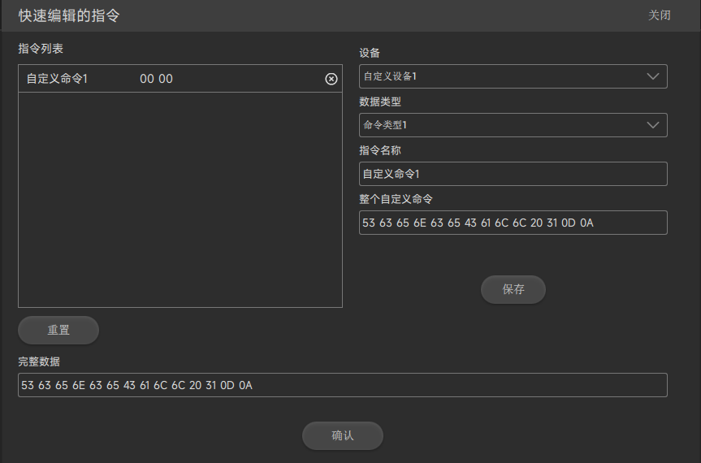
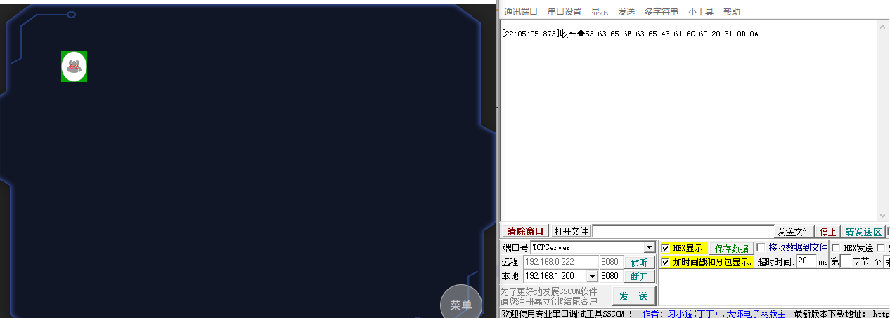

# 新手入门

## 创建一个项目
点击Design 左上角 “+” 出现如下界面  
  
操控台名称： 他会显示在终端界面的标题上(此处我们设为Demo1)  
屏幕分辨率： 根据终端界面分辨率选择合适的大小分辨率  
点击"创建" 按钮进入设计界面

## 创建一个界面
设计器右上角点击 Demo1 右边的 " + ",出现如下串口  
  
点击 "添加" 按钮  
### 给界面添加背景图片
点击快捷按钮里的"导入图片"，  
  
选择图片所在的目录，打开目录后选择多个需要的图片。可以多次从多个目录里加入图片。  
### 编辑界面
点击界面的编辑按钮  
  
出现编辑界面，    
  
点击 界面的背景图标 选择所需要的图片。  
  
注意： 缩放控件至图片大小 复选框，选中表示 会改变控件的大小， 默认不选，这样图片会铺满整个界面(界面也是一个控件）    
点击界面的"确认"按钮完成界面的背景设置  
## 添加一个按钮
从组件控件里把按钮拖到刚才所创建的界面上  
  
按钮是使用较为常见的一个 控件  
### [按钮参数设置](./button.md)

这里我们以一个按钮控制矩阵调用一个会议场景为例  
- ID   ： 会议模式（ID 只会显示在设计器中，在终端设立运行是不会显示的）
- 设备 ： 选择**矩阵设备**  [如何创建设备?](./devices.md)
- 文本 ： 会议（这个字符会显示在终端设备的按钮上）
- 修改文本的颜色和合适大小字体
#### 添加按钮图片
- 正常：就是平时没有动作时候的样子。 这里我们选择    
- 按下： 就是鼠标点击按下时候的样子。这里我们选择    
#### 添加按钮命令
- 指令：
  按下发送： 直接在文本框里填写数据   
  或者调用之前编辑过的指令(点击) 
             出来 **快速编辑的指令** 界面
             
- 指令列表 ： 表示目前这个数据类型下面已经有的指令。点击指令右边的小x 表示删除该条指令。  
              重置按钮表示恢复内部初始化的内容，之前编辑的会丢失。
- 快速编辑指令 是预存了某些类型的 命令格式 方便人员编写命令而已。
- 数据类型 ：是预先在软件里定义了一些命令格式的分类集合。
- 指令名称 ：自己命名的名字
- 固定开始 ：是一个指令固定的几个字符，一般指令都是以几个固定字节开始。

- 保存  按钮保存修改过的指令,方便下次调用。
- 确认 按钮 把编辑或者选择好的 指令 附加到 前面的按钮。

### 添加自定义指令
  我们以 矩阵场景调用为例子  

|命令| 解释说明|  |
|:-----:|:-------|----|
| ASCII  |ScenceCall x\r\n | \r 表示回车,\n 表示换行，x 表示第几个场景，这里用1|
| HEX  | 53 63 65 6E 63 65 43 61 6C 6C 20 31 0D 0A||

如下图  

点击确认后 我们创建的按钮就带上这条指令了

### 测试

现在我们来测试刚才按钮添加的指令  
由于这按钮绑定的是矩阵设备，而矩阵设备我们设置的IP 是 192.168.1.200 端口是8080
我们把电脑的IP 改为 192.168.1.200
打开一个网络助手，创建一个网络服务端来模拟矩阵。然后运行电脑PC 的终端
点击“会议” 按钮， 在服务端 接收到 由这个按钮发出的数据

### 下载
[下载](../demo/Demo1.zdp)

